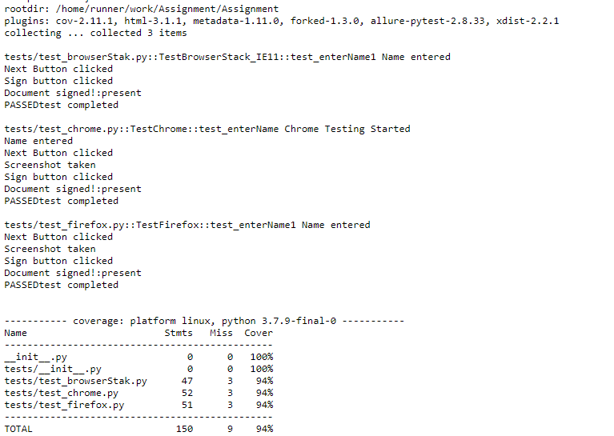

# Assignment

    Description: 
      Test cases has been written according to requirement and also build CI by using Github actions on ubuntu 
      server and also showing test coverge results.
      Test cases are running both with headless on Chrome & Firefox and also integrated with BrowserStack(IE11).
  
    Tests Files (For code review):
      tests
        -- test_browserStak.py
        -- test_chrome.py
        -- test_firefox.py
  
    Test can run on local machine on window 10 by installing required software (python3.7, pycharm) & packages  
        
    Install packages
    python -m pip install --upgrade pip
    pip install selenium
    pip install webdriver-manager
    pip install pytest
    pip install pytest-html
    pip install pytest-cov
    pip install pytest-xdist
    pip install coverage
    pip install pytest-cov

  # Run Test
  py.test tests/ -v -s --cov

  # Test Case
    Create a selenium test using Python that does the following:
    1- Go to https://staging.scrive.com/t/9221714692410699950/7348c782641060a9
    2- Fill in the full name in the document.
    3- Click on Next
    4- There should be a confirmation modal (the one that has text "by clicking the button you will..."). 
    Take a screenshot of this confirmation modal and try to make it only show what is actually visible in
    the modal (not the whole web page).
    5- Sign the document
    6- Verify that there is a text “Document Signed” on the screen.

    Make the test runnable on both Firefox and Chrome -------------------------- Done 
    Make the test runnable on IE11 on Browserstack ----------------------------- Done
    Document how to run the test on Ubuntu ------------------------------------- Build CI by using GitHub action 

# Test Result
    Test results avaliable in 
    Repo Actions
        -- All workflows and check all results 
    
    

        
        
    

